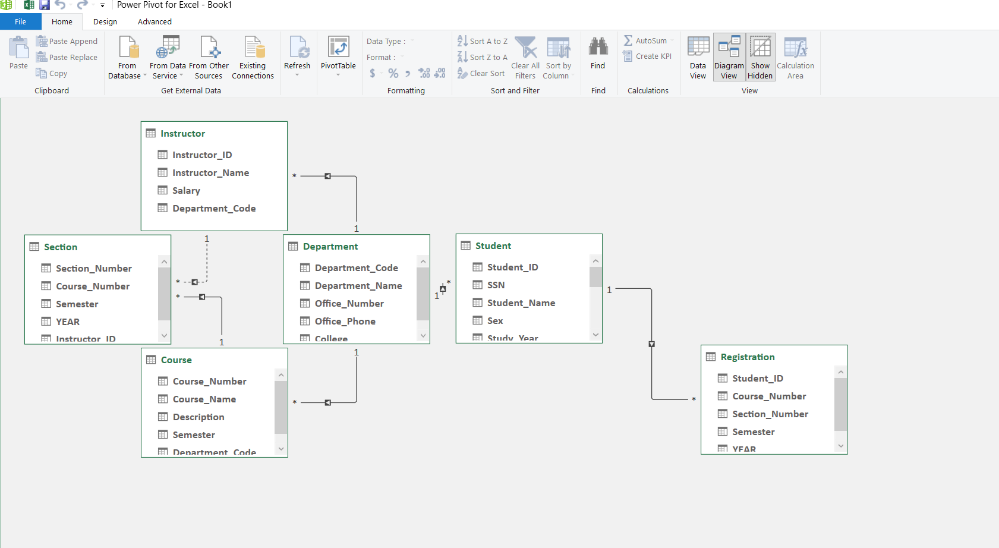
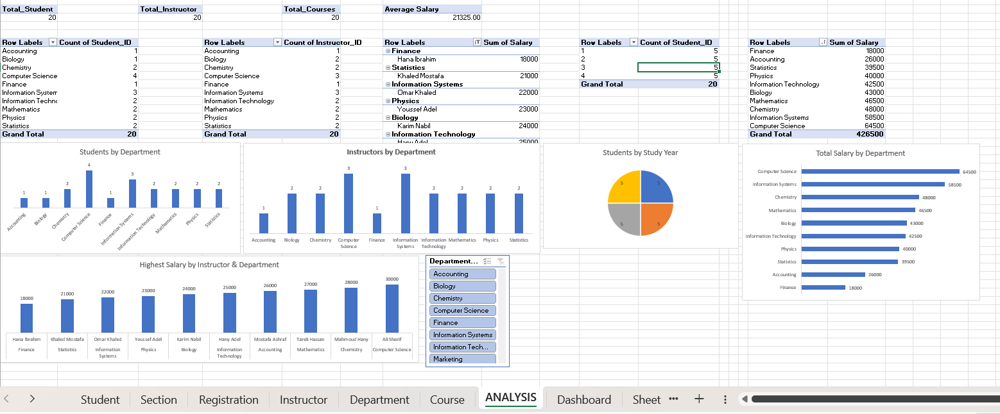
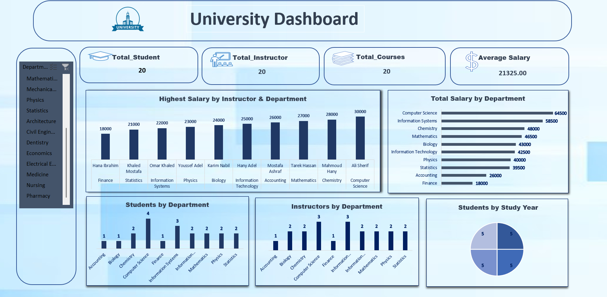

# University Data Analysis – Excel

This folder contains the Excel analysis part of the **University Database & Data Analysis Project**.

After creating and populating the University Database using SQL Server, the data was imported into Excel for further analysis using **Power Pivot, PivotTables, KPIs, and charts**.

## Power Pivot

The data was loaded into **Power Pivot** and the relationships between the tables were created to build the data model.

### Power Pivot Data Model

## KPIs

The dashboard includes the following KPIs:

* **Total Students**
* **Total Courses**
* **Total Instructors**
* **Average Salary**

## PivotTable Analysis

Several PivotTables were created to analyze the university data:

* **Students by Department**
* **Instructors by Department**
* **Highest Salary by Instructor & Department**
* **Total Salary by Department**
* **Students by Study Year**

### PivotTables

## Dashboard

The final dashboard combines the KPIs, PivotTables, and charts to provide an overview of the university data.

### Dashboard Preview

## Excel File

[View Excel Analysis](./UNIVERSITY_DASH.xlsx)

## Tools Used

* **Microsoft Excel**
* **Power Pivot**
* **PivotTables**
* **KPIs**
* **Charts**

