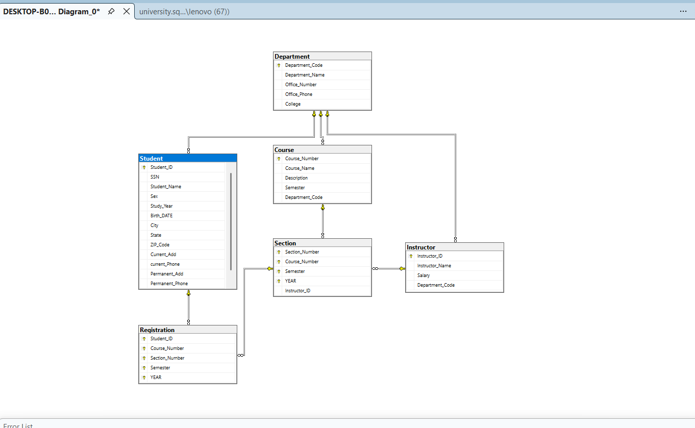

# University Database – SQL

This folder contains the SQL part of the **University Database & Data Analysis Project**.

## Database Design

The database was designed using **SQL Server** based on the given university requirements.

It includes:

* Students
* Departments
* Courses
* Sections
* Instructors
* Student course registration

### Database Diagram

## SQL Implementation

The SQL file includes:

* Database and table creation.
* Primary keys and foreign keys.
* Relationships between tables.
* Sample data insertion.
* Stored procedures for different reports and analysis.

### Reports

The stored procedures were created to answer questions such as:

* Number of instructors in each department.
* Department offering the maximum number of courses.
* Instructors and the courses they teach.
* Number of students in each department.
* Department with the highest total instructor salary.
* Department with the highest number of students.
* Instructors earning more than the average salary of their department.
* Department office telephone associated with the highest instructor salary.
* Students registered for more than three courses.
* Number of instructors in each course.

### SQL File

[View University SQL Code](./university.sql)

